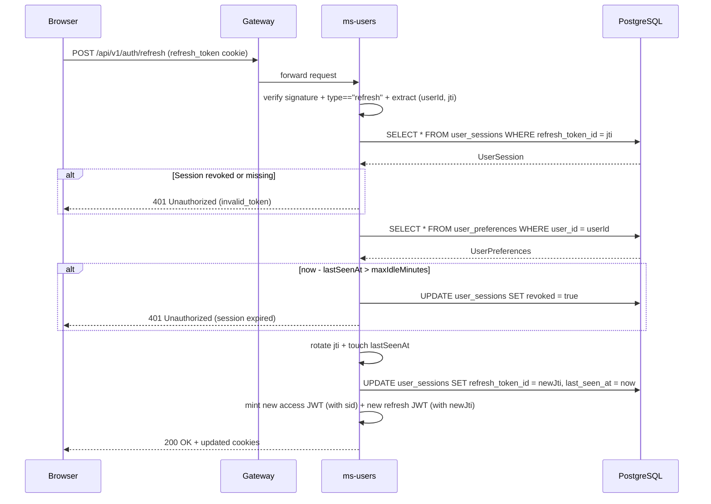

# ms-users — Auth & Users Service

> Human-facing. Facts an implementer needs live in `back/ms-users/.ai/` — this page holds the
> reasoning behind them and does not restate them. If the two disagree, the repo file wins.

`ms-users` is the sole authentication authority for the platform. It handles user registration, login, session registry management (`UserSession`), session refresh (with rotation, refresh-time revocation, and inactivity policy enforcement), server-side logout, user profile editing, change password (with other-session revocation), display/currency-format preferences (`UserPreferences`), and per-user manual currency rates (`ManualCurrencyRate`).

All tokens live in HttpOnly cookies — the JavaScript layer never touches access or refresh tokens directly. CSRF protection is enforced via `CookieCsrfTokenRepository`; auth endpoints are exempt. Downstream services receive the authenticated user's identity through the `X-User-Id` header injected by the gateway's `JwtAuthFilter`.

### Session Revocation Trade-off

Revocation is enforced at **refresh time only**. The gateway's per-request HMAC verification remains fast and stateless. Revoking a session prevents future token refreshes; the active access token lives out its remaining ≤24h TTL.

---

## Refresh Sequence with Session Validation

